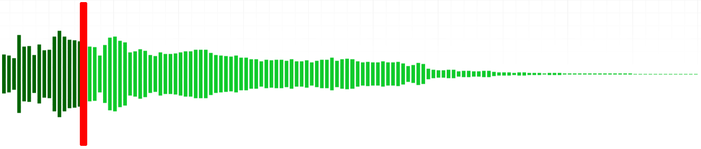

# mkdocs-wavesurfer

This is a plugin for [mkdocs](https://www.mkdocs.org/) that adds a nice waveform display for `<audio>` elements using [wavesurfer.js](https://wavesurfer.xyz/).

This plugin depends on [mkdocs-audiotag](https://github.com/aeskildsen/mkdocs-audiotag).

## Quick start

### Install the plugin

This package is not published on PyPi (yet), so we install from GitHub:

```shell
pip install git+https://github.com/aeskildsen/mkdocs-wavesurfer.git#egg=mkdocs-wavesurfer
```

### Enable the plugin in mkdocs.yml

```yaml
plugins:
  - mkdocs-audiotag # required!
  - mkdocs-wavesurfer
```

### Embed an audio file

As described on the [mkdocs-audiotag readme](https://github.com/aeskildsen/mkdocs-audiotag).

```markdown

```

## Configuration

You can tweak how *wavesurfer.js* displays the waveform using a range of configuration options. See the [wavesurfer.js documentation](https://wavesurfer.xyz/docs/types/wavesurfer.WaveSurferOptions) and the very nice [visual examples](https://wavesurfer.xyz/examples/?all-options.js) for a full description.

Add your options under the `mkdocs-wavesurfer` plugin in your `mkdocs.yml`. You only need to specify the options you want to override. All others will use default values.

```yaml
plugins:
  - mkdocs-audiotag
  - mkdocs-wavesurfer:
      height: 80
      waveColor: "#0fcb2bff"
      progressColor: "darkblue"
      barWidth: 3
      barGap: 1
```



### Autoconfigured options

Please note that the following options get populated automatically by the plugin:

- `mediaControls`
- `media`
- `url`
- `container`

If you would like to remove the browser's default media controls, you can do so by configuring [mkdocs-audiotag](https://github.com/aeskildsen/mkdocs-audiotag):

```yaml
plugins:
  - mkdocs-audiotag:
      controls: false
  - mkdocs-wavesurfer
```

## License

This plugin is licensed under the MIT license.

Beware that [wavesurfer.js is licensed under the BSD-3-Clause license](https://github.com/katspaugh/wavesurfer.js?tab=BSD-3-Clause-1-ov-file).
